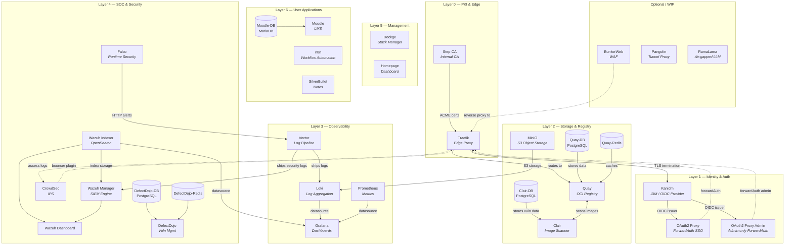
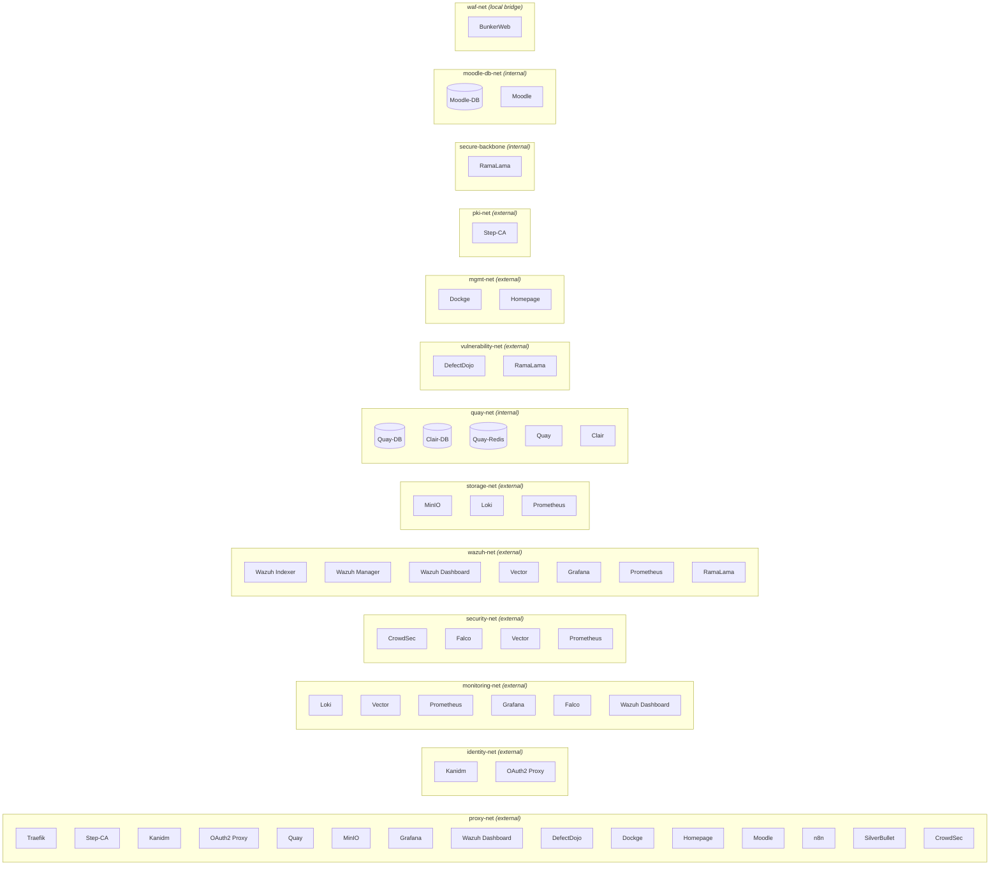

# GEMINI Context: Geo-Brain (Single Source of Truth)

This repository serves as the Single Source of Truth (SSOT) for a DISA STIG compliant, single-node homelab. It manages infrastructure-as-code via Podman and Docker Compose.

## Core Architecture
- **Host OS:** openSUSE MicroOS or Fedora CoreOS (Transactional/Atomic, Read-Only Root FS).
- **Container Engine:** Podman (Rootless by default).
- **Domain:** `${DOMAIN}` (Default: `example.local`).
- **Interface:** 
  - Primary: Podman remote access (via `podman.socket`).
  - Secondary: `ssh` (Break-glass/Fix-only).

## Mandates & Standards
- **STIG Compliance:** All configurations must align with DISA STIGs for Linux and Container Security.
- **Tool Selection:** All tools added as a stack must be DISA STIG compliant, highly relied upon (industry-backed), and regularly scanned/maintained.
- **Rootless:** All containers MUST run as rootless. Exceptions (e.g., Falco eBPF) must be explicitly labeled with `security.stig.bypass_privileged=true`.
- **Reliability:** Every service must define `deploy.resources.limits` and `healthcheck`.
- **Zero-Trust mTLS Architecture:** All backend services and databases MUST utilize the mTLS Sidecar Pattern (e.g., Caddy). Applications bind strictly to `127.0.0.1` and share a network namespace with a sidecar proxy that handles mTLS termination via Step-CA. 
- **Network Micro-Segmentation:** Applications reside on dedicated Podman networks. Internal backend networks MUST be set to `internal: true` to air-gap them and drop the default NAT gateway. No inter-stack communication unless explicitly defined via an mTLS sidecar.
- **Air-gap Preparedness:** All images are pinned to specific versions/digests. No `:latest` tags.
- **Data Separation:** Persistent data lives under `${DATA_DIR}` (default `/var/Geo-Brain`) on a large partition. Config files stay relative (`./config`) for rsync portability. New stacks mount data as `${DATA_DIR}/<stack-name>/...`.
- **Single Source of Truth:** All infrastructure state is defined in this repository. Manual changes on the host are forbidden.
- **HTTPS Only:** All HTTP endpoints MUST be encrypted with TLS. Plain HTTP is only allowed for local bootstrap redirects to HTTPS.

## Application Stack 

### Management & Dashboard
- **Homepage:** Centralized dashboard with service discovery via labels.
- **Dockge:** Primary stack manager for Compose-based deployments.
- **RamaLama:** AI-driven log analysis using local LLMs (e.g., Phi-3) for air-gapped SOC operations.

### Security Operations Center (SOC)
- **Wazuh (SIEM/XDR):** Centralized security monitoring and log indexing.
- **Falco:** Runtime security monitoring using the nodriver (userspace) engine. Detects anomalies, including inter-container network bypasses.
- **CrowdSec:** Intrusion prevention and multi-layer blocking. Configured strictly as Air-Gapped (Zero Telemetry/Upload). Powers the automated remediation loop by parsing Falco alerts via Vector and updating Caddy sidecar bouncers.
- **DefectDojo:** Vulnerability management and orchestration of scan results.

### Observability & Logging (The "LGV" Stack)
- **Grafana:** Centralized visualization for metrics and logs.
- **Prometheus:** Time-series metrics collection and alerting.
- **Loki:** Log aggregation and long-term storage.
- **Vector:** High-performance log pipeline for host and container log collection.

### Identity & Security Infrastructure
- **Kanidm (IDM):** Primary Identity Management server (LDAP/OIDC).
- **OAuth2 Proxy (Auth Portal):** OIDC-based forward-auth proxy for SSO via Kanidm.- **Step-CA (PKI):** Internal Certificate Authority for automated TLS (`*.example.local`).
- **Quay (Registry):** Local OCI registry and pull-through cache with integrated Clair scanning.
- **MinIO (Storage):** S3-compatible object storage for Loki chunks and Velero/Restic backups.

### Optional Stacks (WIP)
- **Pangolin (Tunnel Proxy):** Identity-aware reverse proxy and WireGuard VPN for zero-trust remote access. Replaces Traefik + OAuth2 Proxy when used.
- **BunkerWeb (WAF):** L7 Web Application Firewall with ModSecurity + OWASP CRS, rate limiting, DDoS protection, and CrowdSec integration. Sits in front of Traefik.

## CI/CD & DevSecOps Pipeline
- **Bidirectional Git Mirroring (Optional):** Implement an automated, two-way Git mirror between the internal Git server and GitHub.com. Personal user work is pushed to the internal server, undergoes security scanning via DefectDojo, and upon approval and merge to `main`, state is safely synchronized back to GitHub.com.
- **Routine Repository Scanning:** A scheduled, routine runner MUST be configured to continuously scan all mirrored repositories on the internal Git server to detect newly disclosed vulnerabilities or configuration drift.
- **Ephemeral Sandboxed Runners:** CI/CD runners MUST be ephemeral and utilize kernel-level sandboxing (e.g., gVisor, Kata Containers) to securely build and run Docker containers (Docker-in-Docker) without contaminating host state or requiring unsafe privileged access.
- **Automated Security Gates:** DefectDojo acts as an uncompromising quality gate. Commits must be scanned, and merges to `main` blocked if the vulnerability threshold is breached.
- **AI-Driven Code Review & Log Condensation:** RamaLama MUST be integrated into the pipeline to perform automated, localized code reviews on pull requests and to condense massive DefectDojo security logs into actionable summaries.

## Tooling & Automation
- **`init-node.sh`:** Thin wrapper that handles SSH agent setup, argument parsing, and pre-flight checks, then delegates to the Ansible playbook. Accepts `--host`, `--user`, `--key`, `--port`, `--yes` flags; omitted options are prompted interactively.
- **`ansible/init-node.yml`:** Ansible playbook that provisions the remote homelab node (Podman, `podman.socket`, `auditd`, SELinux, firewalld, subuids, linger, sysctl), then registers a local `podman system connection` for remote access. Confirms major changes (package installs, firewall rules, SELinux, podman-remote registration) unless `--yes` / `-e auto_yes=true` is passed.
- **`deploy.sh`:** STIG-compliant deployment wrapper. Validates image pinning, resource limits, and network isolation locally, then syncs and deploys stacks to the remote node via SSH. Falls back to local deployment if no remote is configured.
- **`setup-brain.sh`:** Idempotent rootless Podman post-deployment bootstrapper. It configures Quay as the primary registry, injects the Step-CA root certificate into Traefik, handles automated generation and storage of OIDC secrets, and securely bridges initial application credentials (e.g., DefectDojo).
- **`scripts/sast/sast-scan.sh`:** Automated security scanning using Checkov, Gitleaks, Grype, and Semgrep.
- **`scripts/secrets/gen-selfsigned-certs.sh`:** Generates required certificate/key bundles with normalized filenames for required stacks (Traefik, Kanidm). Also supports importing existing certificates and converting them to the required filenames and bundle formats.

## Health Monitoring
- Monitor `transactional-update` (MicroOS) or `rpm-ostree` (CoreOS) status.
- Monitor `podman.socket` health.
- Monitor Wazuh/Falco alerts for compliance drift.

## Design Philosophy
- **Declarative:** All deployments and configurations must be strictly declarative. If a tool requires manual GUI setup, find a way to declare it via config files, environment variables, or automated CLI bootstrapping.
- **Idempotency:** Scripts and automation must be safe to run multiple times without causing failures or unintended side-effects. Always check state before applying changes.
- **Simplicity & Maintainability:** The architecture must remain simple and easy to understand. Avoid convoluted logic. New stacks should easily integrate by following the provided templates.

---

## Dependency Matrix & Reference Contract

> **Reference Contract:** Before modifying any file in this repository, cross-reference the DAG and Blast Radius tables below. If a change alters a downstream consumer, flag the conflict, map required downstream changes, and implement a Strangler Fig migration pattern rather than a destructive in-place mutation.

### Deployment Order DAG (deploy.sh boot sequence)



### Network Segmentation Map



### Blast Radius Matrix — Per-Component

| Component | Upstream Dependencies | Downstream Consumers | Networks | Security Blast Radius |
|---|---|---|---|---|
| **Step-CA** | — (root of trust) | Traefik (ACME certs), all TLS-terminating services | `pki-net`, `proxy-net` | **CRITICAL.** If Step-CA goes down: no new certs issued, ACME renewal fails. Existing certs remain valid until expiry. If CA key is compromised: entire TLS trust chain is broken — every service's identity is suspect. Requires full cert rotation. |
| **Traefik** | Step-CA (ACME), Podman socket (Docker provider), OAuth2 Proxy (forwardAuth), CrowdSec (bouncer plugin) | **ALL** web-exposed services (every `traefik.enable=true` stack), CrowdSec (access logs) | `proxy-net`, `identity-net`, `mgmt-net`, `monitoring-net`, `security-net`, `wazuh-net`, `vulnerability-net`, `quay-net`, `pki-net`, `storage-net` | **CRITICAL.** Single point of ingress. Outage = total loss of web access to all services. Config change to `entryPoints` or `middlewares` affects every routed service. Adding/removing a network breaks routing to that network's services. Podman socket mount is a container-escape vector if Traefik is compromised. |
| **Kanidm** | TLS certs (`certs/kanidm-chain.crt`, `certs/kanidm.key`) | OAuth2 Proxy (OIDC issuer), OAuth2 Proxy Admin, MinIO (OIDC), DefectDojo (OIDC), all SSO-protected services transitively | `identity-net`, `proxy-net` | **CRITICAL.** Identity provider for entire platform. Outage = no new SSO logins (existing sessions survive until cookie expiry). Password/config change breaks all OIDC clients. If compromised: attacker gains identity of any user, can forge OIDC tokens, and access all SSO-protected services. Recovery requires credential rotation for all OIDC clients. |
| **OAuth2 Proxy** | Kanidm (OIDC), Traefik CA bundle (`ca-bundle.crt`), `OAUTH2_PROXY_CLIENT_SECRET`, `OAUTH2_PROXY_COOKIE_SECRET` | Traefik (forwardAuth middleware `oauth2-proxy@file`), Homepage, Moodle, n8n, SilverBullet — all `brain_users` + `brain_admins` access | `identity-net`, `proxy-net` | **HIGH.** Outage = users get 401/502 on all OAuth2-proxy-protected routes. Cookie secret rotation invalidates all active sessions. Client secret mismatch = authentication loop. CA bundle mismatch = OIDC validation failure. |
| **OAuth2 Proxy Admin** | Same as OAuth2 Proxy | Traefik (forwardAuth middleware `oauth2-proxy-admin@file`), Grafana, Prometheus, Traefik Dashboard, Wazuh Dashboard, DefectDojo, Dockge — all `brain_admins`-only access | `identity-net`, `proxy-net` | **HIGH.** Outage = admins locked out of infrastructure dashboards. Same secret dependencies as OAuth2 Proxy. |
| **MinIO** | Kanidm (OIDC, optional) | Loki (S3 backend for log chunks), future: Velero/Restic backups | `storage-net`, `proxy-net` | **HIGH.** Outage = Loki cannot write/read log chunks, ingester stalls, log pipeline backs up. Data loss if MinIO storage is corrupted. Credential change requires updating Loki's S3 config. Bucket deletion = permanent log data loss. |
| **Loki** | MinIO (S3 storage), `MINIO_ROOT_USER`, `MINIO_ROOT_PASSWORD` | Grafana (datasource), Vector (sink target) | `monitoring-net`, `storage-net` | **MEDIUM.** Outage = Grafana log queries fail, Vector buffers logs locally. No data loss if MinIO is healthy (Vector has disk buffer). Config change to `loki-config.yaml` schema requires migration. |
| **Vector** | Podman socket (container logs), host `/var/log` (journald), Falco (HTTP alerts on `:8686`) | Loki (log sink), Wazuh Manager (syslog sink on `:1514`), Prometheus (metrics exporter on `:9598`) | `monitoring-net`, `wazuh-net`, `security-net` | **MEDIUM.** Outage = logs stop flowing to Loki and Wazuh. Falco alerts are dropped. Security monitoring is blind. No permanent data loss (host logs persist). Podman socket mount is a read-only container-escape vector. |
| **Prometheus** | Scrape targets: Vector `:9598`, Loki `:3100`, Traefik `:8082`, Grafana `:3000`, MinIO `:9000`, CrowdSec `:6060`, Wazuh Indexer `:9200` | Grafana (datasource) | `monitoring-net`, `proxy-net`, `security-net`, `wazuh-net`, `storage-net` | **MEDIUM.** Outage = no metrics collection, Grafana metrics dashboards empty. Historical data preserved in TSDB. Scrape target changes (port/host) require `prometheus.yml` update. |
| **Grafana** | Prometheus (datasource), Loki (datasource), Wazuh Indexer (OpenSearch datasource), OAuth2 Proxy Admin (auth headers) | End users (visualization) | `monitoring-net`, `wazuh-net`, `proxy-net` | **LOW.** Outage = no dashboards. All data preserved in upstream sources. Auth header config change requires matching OAuth2 Proxy header config. |
| **Wazuh Indexer** | — (self-contained OpenSearch) | Wazuh Manager (Filebeat output), Wazuh Dashboard, Grafana (OpenSearch datasource), Prometheus (scrape target) | `wazuh-net` | **HIGH.** Outage = Wazuh Manager Filebeat queues alerts, Dashboard shows no data. Requires 2G+ memory — OOM kills cascade to Manager. Security plugin disabled (`plugins.security.disabled: true`) — network isolation is the only access control. |
| **Wazuh Manager** | Wazuh Indexer (Filebeat output target) | Vector (syslog listener on `:1514`), Wazuh Dashboard, external agents on `:1514`/`:1515` | `wazuh-net` | **HIGH.** Outage = no SIEM analysis, incoming agent data queued or dropped. `seccomp:unconfined` + elevated caps make this the highest-privilege container. Compromise = arbitrary host log injection. Port `:55000` API exposure requires strong auth. |
| **Wazuh Dashboard** | Wazuh Indexer, Wazuh Manager, OAuth2 Proxy Admin (auth) | End users (SIEM UI) | `wazuh-net`, `monitoring-net`, `proxy-net` | **LOW.** Read-only UI. Outage = no SIEM web interface; data safe in Indexer. |
| **Falco** | Host `/dev`, `/proc`, `/etc` (read-only), `privileged: true` | Vector (HTTP alerts to `:8686/falco`) | `security-net`, `monitoring-net` | **MEDIUM.** Outage = no runtime anomaly detection. `privileged: true` (bypass-labeled) — if compromised, full host access. Read-only mounts limit blast radius. Alert pipeline is one-way (push to Vector). |
| **CrowdSec** | Traefik access logs (volume mount), host logs (`/var/log`), `CROWDSEC_BOUNCER_API_KEY` | Traefik (bouncer plugin on LAPI `:8080`), BunkerWeb (integrated CrowdSec) | `security-net`, `proxy-net` | **MEDIUM.** Outage = Traefik bouncer plugin fails open (no IP blocking). Bouncer API key rotation requires updating Traefik dynamic config `middleware.yml` and redeploying both stacks. `DISABLE_ONLINE_API=true` ensures air-gap. |
| **Quay** | Quay-DB (PostgreSQL), Quay-Redis, Clair (scanner), self-signed CA cert | All container pulls (registries.conf mirror), Clair (image data), Podman on remote node | `quay-net` (internal), `proxy-net` | **HIGH.** Outage = container pulls from docker.io/ghcr.io/quay.io fail if internet-only mirror is configured. Needs 6G memory. DB corruption = registry metadata loss. Proxy cache org deletion breaks mirror paths in `registries.conf`. |
| **Quay-DB** | — | Quay (data storage) | `quay-net` (internal) | **HIGH.** Outage = Quay cannot start. Data loss = all registry metadata and user accounts destroyed. DB password change requires updating Quay `config.yaml` and `.env`. |
| **Clair** | Clair-DB (PostgreSQL) | Quay (vulnerability scan results) | `quay-net` (internal) | **LOW.** Outage = no new vulnerability scans. Existing scan data preserved in Clair-DB. Does not block image pulls. |
| **DefectDojo** | DefectDojo-DB (PostgreSQL), DefectDojo-Redis, Kanidm (OIDC, optional), OAuth2 Proxy Admin (auth) | End users (vuln management), SAST pipeline (`sast-scan.sh` uploads) | `vulnerability-net`, `proxy-net` | **MEDIUM.** Outage = no vuln management UI. OIDC config change requires matching Kanidm client update. DB password change requires updating `DD_DATABASE_URL`. |
| **Dockge** | Podman socket (read-only), `STACKS_PATH` volume | End users (stack management UI) | `mgmt-net`, `proxy-net` | **MEDIUM.** Outage = no stack management UI. `STACKS_PATH` must match `DOCKGE_STACKS_DIR` or stacks appear inactive. Podman socket mount = read-only container-escape vector. |
| **Homepage** | Podman socket (service discovery), all stack `homepage.*` labels | End users (dashboard) | `mgmt-net`, `proxy-net` | **LOW.** Outage = no dashboard. Pure read-only. Served at root domain `${DOMAIN}` (not `homepage.${DOMAIN}`). |
| **Moodle** | Moodle-DB (MariaDB), OAuth2 Proxy (auth) | End users (LMS) | `proxy-net`, `moodle-db-net` (internal) | **LOW.** Outage = no LMS. `moodle-db-net` is internal (air-gapped). Custom Dockerfile builds from `moodlehq/moodle-php-apache:8.3`. Config changes via env vars only. |
| **n8n** | OAuth2 Proxy (auth) | End users (workflow automation) | `proxy-net` | **LOW.** Outage = no workflows. No database dependency (embedded). |
| **SilverBullet** | OAuth2 Proxy (auth) | End users (notes) | `proxy-net` | **LOW.** Outage = no notes app. Stateless except `/space` volume. |
| **BunkerWeb** | Traefik (reverse proxy target) | External clients (WAF perimeter) | `waf-net`, `proxy-net` | **OPTIONAL.** Not in default boot order. If active: sits in front of Traefik. Outage = WAF bypass (traffic hits Traefik directly if DNS/ports reconfigured). `security.stig.bypass_privileged=true`. |
| **Pangolin** | — | End users (Zero-Trust Tunnel / VPN) | `pangolin-net` | **OPTIONAL.** Replaces Traefik + OAuth2 Proxy when active. Outage = loss of remote tunnel access. Needs high privileges (`NET_ADMIN`) for WireGuard. |
| **RamaLama** | — | Wazuh (log analysis), DefectDojo (vuln triage) | `secure-backbone` (internal), `wazuh-net`, `vulnerability-net` | **LOW.** Air-gapped LLM. `secure-backbone` is `internal: true` (no egress). Outage = no AI-assisted log analysis. |

### Podman Secret & Environment Variable Map

| Secret / Env Var | Created By | Consumed By | Rotation Impact |
|---|---|---|---|
| `OAUTH2_PROXY_CLIENT_SECRET` | `setup-brain.sh` (from Kanidm OIDC) | OAuth2 Proxy, OAuth2 Proxy Admin | Rotation requires: Kanidm client secret reset → `.env` update → OAuth2 Proxy redeploy |
| `OAUTH2_PROXY_COOKIE_SECRET` | `setup-brain.sh` (random gen) | OAuth2 Proxy, OAuth2 Proxy Admin | Rotation invalidates ALL active user sessions |
| `KANIDM_ADMIN_PASSWORD` | `setup-brain.sh` (recovery) | `create-kanidm-user.sh`, `setup-brain.sh` | Rotation requires re-running `setup-brain.sh identity` |
| `MINIO_ROOT_PASSWORD` | User (`.env`) | MinIO, Loki (`loki-config.yaml`) | Rotation requires: `.env` update → MinIO redeploy → Loki config re-render → Loki redeploy |
| `CROWDSEC_BOUNCER_API_KEY` | `setup-brain.sh` (CrowdSec CLI) | Traefik (`middleware.yml`), CrowdSec (auto-register) | Rotation requires: CrowdSec bouncer re-register → `.env` update → Traefik config re-render → Traefik redeploy |
| `QUAY_DB_PASSWORD` | User (`.env`) | Quay (`config.yaml`), Quay-DB | Rotation requires: DB password change → Quay config re-render → both redeploy |
| `CLAIR_DB_PASSWORD` | User (`.env`) | Clair (`clair-config.yaml`), Clair-DB | Rotation requires: DB password change → Clair config re-render → both redeploy |
| `DEFECTDOJO_DB_PASSWORD` | User (`.env`) | DefectDojo (`DD_DATABASE_URL`), DefectDojo-DB | Rotation requires: DB password change → DefectDojo env update → both redeploy |
| `DOJO_SECRET_KEY` | `setup-brain.sh` (random) | DefectDojo (`DD_SECRET_KEY`) | Rotation invalidates existing Django sessions |
| `WAZUH_API_PASSWORD` | User (`.env`) | Wazuh Dashboard (`wazuh.yml`) | Rotation requires: config re-render → Dashboard redeploy |
| `ADMIN_PASSWORD` | User (`.env`) | `setup-brain.sh` (Quay init, DefectDojo) | Initial bootstrap only; post-init rotation is per-service |
| `*_OIDC_SECRET` (per app) | `setup-brain.sh` (Kanidm) | Respective OIDC client stacks | Rotation requires: Kanidm secret reset → `.env` update → consumer stack redeploy |

### Automation Pipeline Dependencies

| Script | Depends On | Modifies | Side Effects |
|---|---|---|---|
| `deploy.sh` | `.env`, `certs/`, all `stacks/*/docker-compose.yml`, SSH key, remote node | Traefik dynamic configs (`gen_*.yml`), remote filesystem, running containers | Creates Podman networks, syncs configs via rsync, renders templates via `envsubst` |
| `setup-brain.sh` | Running containers (Step-CA, Kanidm, Quay, MinIO, DefectDojo, CrowdSec), `.env`, `certs/ca.crt` | `.env` (writes secrets), `stacks/traefik/config/certs/` (CA bundle), Podman secrets, Kanidm OIDC clients | Redeploys OAuth2 Proxy and Traefik as side effects; creates Quay proxy cache orgs |
| `create-kanidm-user.sh` | `.env` (`KANIDM_ADMIN_PASSWORD`), `certs/ca.crt`, running Kanidm, SSH Key | Kanidm user database | Creates person, adds to group, generates credential reset token |
| `scripts/sast/sast-scan.sh` | Local tooling (Checkov, Gitleaks, Grype, Semgrep) | Scan results (stdout/files) | Read-only; no infrastructure side effects |
| `scripts/analysis/validate_stacks.py` | All `stacks/*/docker-compose.yml` | Stdout (validation results) | Read-only; no infrastructure side effects |
| `init-node.sh` → `ansible/init-node.yml` | SSH access to target node | Remote node: Podman, `podman.socket`, audit, SELinux, firewall, sysctl, `podman system connection` | Destructive: modifies remote OS configuration |

### Boot Order & Critical Path

```
deploy.sh all → deploys in this exact order:

  1. step-ca          ← Root of trust (ACME CA)
  2. traefik          ← Edge proxy (depends on step-ca for certs)
  3. bunkerweb        ← Optional WAF (depends on traefik)
  4. pangolin         ← Optional tunnel (disabled/commented out)
  5. kanidm           ← Identity provider
  6. oauth2-proxy     ← SSO gateway (depends on kanidm)
  7. minio            ← Object storage
  8. loki             ← Log aggregation (depends on minio)
  9. vector           ← Log pipeline (depends on loki, wazuh-manager)
 10. prometheus       ← Metrics (excluded from batch by default)
 11. wazuh            ← SIEM stack (indexer → manager → dashboard)
 12. falco            ← Runtime security (depends on vector for alerts)
 13. crowdsec         ← IPS (depends on traefik logs)
 14. quay             ← Registry (bootstrapped FIRST in batch mode)
 15. defectdojo       ← Vuln mgmt
 16. grafana          ← Dashboards (depends on loki, prometheus, wazuh-indexer)
 17. dockge           ← Stack manager
 18. homepage         ← Dashboard
 19. user/moodle      ← LMS (custom build)
 20. user/n8n         ← Workflow automation
 21. user/notes       ← SilverBullet notes

NOTE: In batch mode (deploy.sh all), Quay is bootstrapped FIRST
(step-ca → traefik → quay) before the rest, to configure the
local registry mirror for all subsequent image pulls.

setup-brain.sh → runs AFTER deploy.sh:
  0. Self-healing & pre-flight
  1. init_quay         → registries.conf, proxy cache orgs, Quay admin
  2. setup_pki         → ACME provisioner, Step-CA root → Traefik, CA bundle
  3. setup_storage     → Podman secrets, OIDC secrets in .env
  4. setup_minio       → loki-data bucket
  5. setup_identity    → Kanidm recovery, OIDC clients, OAuth2 Proxy redeploy
  6. wait_proxies      → Traefik health gate
  7. setup_soc         → DefectDojo admin capture
  8. setup_crowdsec    → Bouncer registration, Traefik redeploy
```
