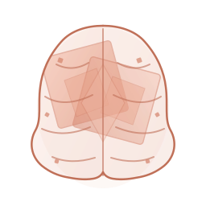

<p align="center">
  
</p>

# Geo-Brain: Single Node Homelab

Welcome to the **Geo-Brain** Single Source of Truth (SSOT) repository. This project deploys a highly secure, STIG-compliant, and fully containerized homelab on a single node using rootless **Podman** and **Docker Compose**.

> **Note:** This is not a CI/CD pipeline. It focuses on operational security, monitoring, and robust zero-trust access for pre-built containers.

For a detailed breakdown of every tool and architectural choice, see **[TOOLS_EXPLAINED.md](./docs/TOOLS_EXPLAINED.md)**. For the overarching security philosophy and architectural mandates, see **[GEMINI.md](./GEMINI.md)**.

---

## 📖 Overview

The Geo-Brain homelab is organized into discrete **stacks**:

- **Core Infrastructure:** `step-ca` (Internal PKI), `quay` (Container Registry), `traefik` (Reverse Proxy)
- **Identity & Access:** `kanidm` (Identity Provider), `oauth2-proxy` (SSO via OIDC)
- **Security Operations:** `wazuh` (SIEM), `falco` (Runtime Security), `crowdsec` (IPS)
- **Observability:** `prometheus` & `grafana` (Metrics), `vector` & `loki` (Logs)
- **Management:** `homepage` (Dashboard), `dockge` (Stack UI)

---

## 🚀 Quick Start Guide

Follow these steps to deploy Geo-Brain from scratch on a remote node (e.g., `myhost.example.local`).

### Step 1: Environment Configuration

Copy the template and set your domain and secrets:

```bash
cp .env-template .env
```
Edit `.env` to configure your target `DOMAIN` (default: `example.local`), connection settings (`REMOTE_HOST`, `REMOTE_USER`), and critical passwords. **Do not commit your `.env` file.**

### Step 2: Initialize the Node

Run the node initialization script to install dependencies (Podman, Ansible), configure SELinux/firewalld, set up Podman networks, and create the required data directories:

```bash
./init-node.sh
```

### Step 3: Generate Certificates

Generate the root CA and required SSL certificates for `step-ca`, `quay`, and `kanidm`:

```bash
./scripts/secrets/gen-selfsigned-certs.sh
```

### Step 4: Deploy the Infrastructure

Deploy all stacks. The script automatically handles bootstrapping Quay and Step-CA before rolling out the remaining services:

```bash
./deploy.sh all up
```

### Step 5: Post-Deployment Setup

Run the setup script to initialize identities, integrate Step-CA with Traefik via ACME, and configure rootless service accounts:

```bash
./setup-brain.sh
```

### Step 6: Trust the Root Certificate

To avoid browser warnings, install the generated Root CA onto your local workstation:

- **Fedora/RHEL/openSUSE:** 
  ```bash
  sudo cp certs/ca.crt /etc/pki/ca-trust/source/anchors/Geo-Brain-ca.crt && sudo update-ca-trust
  ```
- **macOS:**
  ```bash
  sudo security add-trusted-cert -d -r trustRoot -k /Library/Keychains/System.keychain certs/ca.crt
  ```
*(You can also use `./scripts/secrets/gen-selfsigned-certs.sh --trust-local` to automate this).*

### Step 7: Initial Logins & User Setup

Your central access point for all services is the **Homepage (Dashboard):** `https://home.<DOMAIN>`

Before logging into downstream apps, you **must** bootstrap your identity provider:

1. **Kanidm (Identity):** `https://kanidm.<DOMAIN>`
   - `setup-brain.sh` automatically configures Kanidm (registering OIDC clients and injecting the generated secrets back into your `.env`).
   - Use the `idm_admin` recovery password shown at the end of the setup script to log in.
   - **Create Your User Account:**
     - The Kanidm Web UI for the `idm_admin` account does not expose user creation natively. The intended method is via the Kanidm CLI.
     - We have provided a wrapper script to automate creating your first daily-driver user account (e.g., `admin`). Run:
       ```bash
       ./scripts/create-kanidm-user.sh supercoolusername "Global Admin"
       ```
     - It will prompt you for the `idm_admin` recovery password and then automatically generate a secure, temporary initial password for your new account.
     - You will use this new account and password to log into all SSO-protected services (Quay, Grafana, DefectDojo, etc.). You can change the password later by logging into the Kanidm Web UI (`https://kanidm.<DOMAIN>`).


2. **Quay (Registry):** `https://quay.<DOMAIN>`
   - **SSO:** Already configured declaratively. Simply click 'OIDC' on the login screen once the Kanidm client is created.
   - **Local Admin:** Use for break-glass only. Set up during first visit if OIDC is not yet active.

3. **Wazuh (SIEM):** `https://wazuh.<DOMAIN>`
   - **SSO:** Already configured declaratively. Uses `Preferred_Username` claim from Kanidm.
   - **Local Admin:** Default credentials are `admin` / `admin`. Change this immediately.

4. **DefectDojo (Vulnerability Management):** `https://defectdojo.<DOMAIN>`
   - **SSO:** Already configured declaratively. Click "Log in via Kanidm SSO."
   - **Local Admin:** Extract randomly generated password from initializer logs:
     `podman logs defectdojo-initializer 2>&1 | grep "Admin password:"`

5. **MinIO (Object Storage):** `https://minio.<DOMAIN>`
   - **SSO:** Already configured declaratively. Click "Login with OpenID."
   - **Local Admin:** Uses `MINIO_ROOT_USER` / `MINIO_ROOT_PASSWORD` from your `.env`.

7. **Grafana (Observability):** `https://grafana.<DOMAIN>`
   - **SSO:** Automatic via OAuth2 Proxy ForwardAuth headers. No manual setup required.

8. **Dockge (Stack Management):** `https://dockge.<DOMAIN>`
   - First-time access will prompt you to create the local admin account.
   - Use Dockge to visually manage, start, stop, and read logs of all your deployed Compose stacks.

---

## 🧹 Maintenance & Teardown

If you need to completely wipe the installation (destroy all data, volumes, and containers) and start fresh:

```bash
./scripts/clean-node.sh
```
*Warning: This script permanently deletes `/var/Geo-Brain` and all rootless podman data on the remote node.*

---

## ⚙️ How to Deploy Individual Stacks

The `deploy.sh` script dynamically generates Traefik configurations and manages stack lifecycles over SSH using `podman-compose`.

```bash
# Bring up a specific stack
./deploy.sh <stack_name> up

# Tear down a stack
./deploy.sh <stack_name> down

# View logs for a stack
./deploy.sh <stack_name> logs

# Validate STIG compliance of a stack without deploying
./deploy.sh <stack_name> check
```

---

## 👤 Adding User Applications

You can deploy your own uncommitted applications via the `user/` directory.

1. Create a folder: `mkdir -p stacks/user/myapp`
2. Add your `docker-compose.yml`.
3. Deploy it: `./deploy.sh user/myapp up`

All user stacks automatically receive Traefik reverse proxy configuration if they include the label `traefik.enable=true`.
