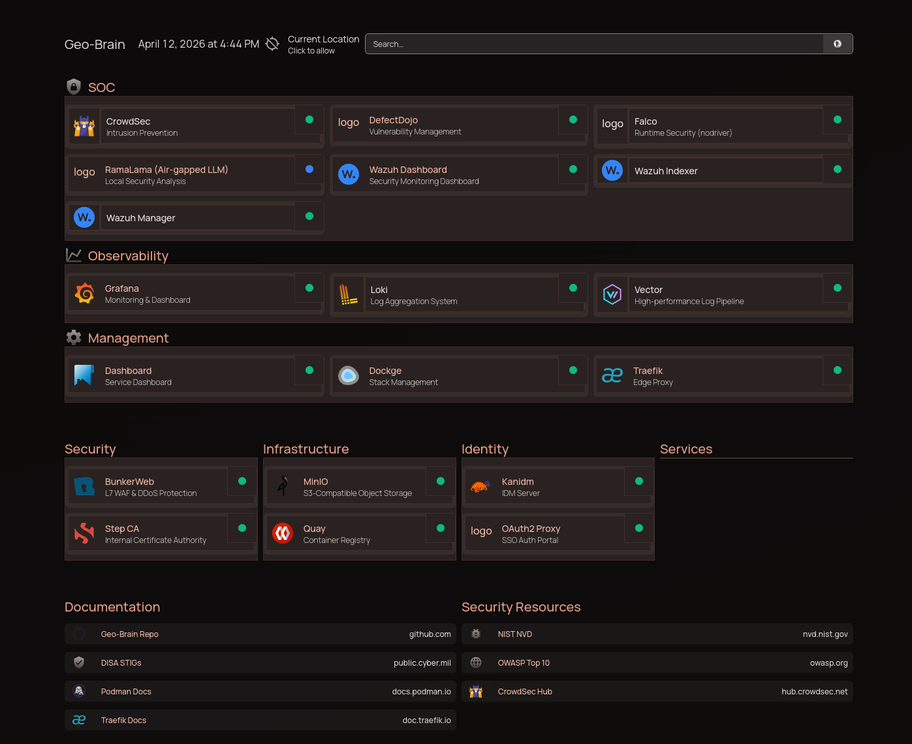

<p align="center">
  
</br>

</p>


# My-HomeLab: Single Node Homelab

Welcome to the **My-HomeLab** Single Source of Truth (SSOT) repository. This project deploys a highly secure, STIG-compliant, and fully containerized homelab on a single node using rootless **Podman** and **Docker Compose**.

> **Note:** This is not a CI/CD pipeline. It focuses on operational security, monitoring, and robust zero-trust access for pre-built containers.

For a detailed breakdown of every tool and architectural choice, see **[TOOLS_EXPLAINED.md](./docs/TOOLS_EXPLAINED.md)**. For the overarching security philosophy and architectural mandates, see **[GEMINI.md](./GEMINI.md)**.

---

## 📖 Overview

The My-HomeLab homelab is organized into discrete **stacks**:

- **Core Infrastructure:** `step-ca` (Internal PKI), `quay` (Container Registry), `traefik` (Reverse Proxy)
- **Identity & Access:** `kanidm` (Identity Provider), `oauth2-proxy` (SSO via OIDC)
- **Security Operations:** `wazuh` (SIEM), `falco` (Runtime Security), `crowdsec` (IPS)
- **Observability:** `prometheus` & `grafana` (Metrics), `vector` & `loki` (Logs)
- **Management:** `homepage` (Dashboard), `dockge` (Stack UI)
- **CI/CD Pipeline (optional):** `gitea` ([Git Server + Runners](./stacks/gitea/README.md)), `defectdojo` (Vulnerability Management), `ramalama` (AI Log Triage) — deployed together via `./deploy.sh cicd up`
- **Developer Tools (optional):** `pkg-sentinel` ([Supply-Chain Security Proxy](./stacks/pkg-sentinel/README.md)) — deployed via `./deploy.sh dev up`
- **Optional/WIP:** `bunkerweb` (WAF), `pangolin` (Zero-Trust Tunnel)

---

## 🚀 Quick Start Guide

Follow these steps to deploy My-HomeLab from scratch on a remote node (e.g., `myhost.example.local`).

### Step 1: Environment Configuration

Copy the template and set your domain and secrets:

```bash
cp .env-template .env
```
Edit `.env` to configure your target `DOMAIN` (default: `example.local`), connection settings (`REMOTE_HOST`, `REMOTE_USER`), and critical passwords. **Do not commit your `.env` file.**

### Step 2: Initialize the Node

Run the node initialization script to install dependencies (Podman, Ansible), configure SELinux/firewalld, set up Podman networks, and create the required data directories:

```bash
./init-node.sh
```

### Step 3: Generate Certificates

Generate the root CA and required SSL certificates for Traefik, Kanidm, and initial bootstrap:

```bash
./scripts/secrets/gen-selfsigned-certs.sh
```

### Step 4: Deploy the Infrastructure

Deploy all stacks. The script automatically handles bootstrapping Quay and Step-CA before rolling out the remaining services:

```bash
./deploy.sh all up
```

### Step 4b: Deploy CI/CD Pipeline (Optional)

The CI/CD pipeline (Gitea + DefectDojo + RamaLama) is excluded from the default `all` batch. Deploy it separately:

```bash
./deploy.sh cicd up
```

This brings up Gitea (self-hosted Git with CI/CD runners), DefectDojo (vulnerability management), and RamaLama (AI-driven security triage) as a unit on the shared `vulnerability-net` network.

### Step 5: Post-Deployment Setup

Run the setup script to initialize identities, integrate Step-CA with Traefik via ACME, and configure rootless service accounts:

```bash
./setup-brain.sh
```

### Step 6: Trust the Root Certificate

To avoid browser warnings, install the combined CA bundle (which includes the Step-CA root) onto your local workstation:

- **Fedora/RHEL/openSUSE:** 
  ```bash
  sudo cp stacks/traefik/config/certs/ca-bundle.crt /etc/pki/ca-trust/source/anchors/My-HomeLab-ca.crt && sudo update-ca-trust
  ```
- **macOS:**
  ```bash
  sudo security add-trusted-cert -d -r trustRoot -k /Library/Keychains/System.keychain stacks/traefik/config/certs/ca-bundle.crt
  ```
*(You can also run `./scripts/secrets/gen-selfsigned-certs.sh --trust-local` initially, but must manually trust `ca-bundle.crt` after step 5 to secure ACME certificates).*

### Step 7: Initial Logins & User Setup

Your central access point for all services is the **Homepage Dashboard:** `https://<DOMAIN>`

Before logging into downstream apps, you **must** bootstrap your identity provider:

1. **Kanidm (Identity):** `https://kanidm.<DOMAIN>`
   - `setup-brain.sh` automatically configures Kanidm (registering OIDC clients and injecting the generated secrets back into your `.env`).
   - Use the `idm_admin` recovery password shown at the end of the setup script to log in.
   - **Create Your First User Account:**
     ```bash
     # Create an admin with full access to all applications
     ./scripts/create-kanidm-user.sh --role admin myadmin "Global Admin"

     # Create a regular user with access to user stacks only
     ./scripts/create-kanidm-user.sh --role user jdoe "John Doe"
     ```
     The script prompts for the `idm_admin` recovery password and generates a one-time credential reset URL (valid for 1 hour). Share the URL with the user to set their password.

   **RBAC Model — Groups & Scopes:**

   | Group | Role | Access |
   |-------|------|--------|
   | `stig_admins` | Admin | **All** applications — infrastructure, SOC, observability, and user stacks |
   | `stig_users` | User | **User stacks only** — moodle, n8n, notes, and other `user/` applications |

   OAuth2 Proxy enforces group-based access at the Traefik ForwardAuth layer:
   - **Admin-only routes** (Traefik, Wazuh, Dockge, DefectDojo) use the `oauth2-proxy-admin` middleware — requires `stig_admins` membership.
   - **All other routes** use the `oauth2-proxy` middleware — requires `stig_admins` OR `stig_users` membership.
   - OIDC scopes requested: `openid`, `profile`, `email`, `groups`.

2. **Quay (Registry):** `https://quay.<DOMAIN>`
   - **SSO:** Already configured declaratively. Click 'OIDC' on the login screen.
   - **Local Admin:** Use for break-glass only. Set up during first visit if OIDC is not yet active.

3. **Wazuh (SIEM):** `https://wazuh.<DOMAIN>`
   - **SSO:** Protected behind OAuth2 Proxy (admin-only). Kanidm SSO enforced automatically.
   - **Local Admin:** Default credentials are `admin` / `admin`. Change immediately.

4. **Gitea (Git Server & CI/CD):** `https://gitea.<DOMAIN>`
   - **SSO:** Click "Sign in with Kanidm" on the login page. Gitea uses native OIDC (not ForwardAuth) to support git CLI operations.
   - **Local Admin:** Created automatically by `setup-brain.sh`. Username: `admin`.
   - **Runners:** Two runners deploy alongside Gitea — an ephemeral sandbox runner for standard CI/CD, and a routine scanner for scheduled Trivy scans of all mirrored repos.

5. **DefectDojo (Vulnerability Management):** `https://defectdojo.<DOMAIN>`
   - **SSO:** Click "Log in via Kanidm SSO."
   - **Local Admin:** Extract from initializer logs:
     `podman logs defectdojo-django 2>&1 | grep "Admin password:"`

6. **MinIO (Object Storage):** `https://minio.<DOMAIN>`
   - **SSO:** Click "Login with OpenID."
   - **Local Admin:** Uses `MINIO_ROOT_USER` / `MINIO_ROOT_PASSWORD` from your `.env`.

7. **Grafana (Observability):** `https://grafana.<DOMAIN>`
   - **SSO:** Automatic via OAuth2 Proxy ForwardAuth headers. No manual setup required.

8. **Dockge (Stack Management):** `https://dockge.<DOMAIN>`
   - First-time access prompts you to create the local admin account.
   - Use Dockge to visually manage, start, stop, and read logs of all Compose stacks.

---

## 🧹 Maintenance & Teardown

If you need to completely wipe the installation (destroy all data, volumes, and containers) and start fresh:

```bash
./scripts/clean-node.sh
```
*Warning: This script permanently deletes `/var/My-HomeLab` and all rootless podman data on the remote node.*

---

## ⚙️ How to Deploy Individual Stacks

The `deploy.sh` script dynamically generates Traefik configurations and manages stack lifecycles over SSH using `podman-compose`.

```bash
# Bring up a specific stack
./deploy.sh <stack_name> up

# Deploy the CI/CD pipeline (gitea + defectdojo + ramalama)
./deploy.sh cicd up

# Tear down a stack
./deploy.sh <stack_name> down

# Force recreate (rebuild + restart)
./deploy.sh <stack_name> redeploy

# View logs for a stack
./deploy.sh <stack_name> logs

# Validate STIG compliance of a stack without deploying
./deploy.sh <stack_name> check
```

---

## 👤 Adding User Applications

You can deploy your own applications via the `stacks/user/` directory.

1. Create a folder: `mkdir -p stacks/user/myapp`
2. Add your `docker-compose.yml` following the [template](stacks/_template/docker-compose.yml).
3. Deploy it: `./deploy.sh user/myapp up`

All user stacks automatically receive Traefik reverse proxy configuration and OAuth2 Proxy SSO protection if they include the label `traefik.enable=true`. User stacks are accessible to members of both `stig_admins` and `stig_users` groups.
