# My-HomeLab Tools: A Deep Dive

This document provides an educational overview of all tools and technologies used in the My-HomeLab SSOF homelab infrastructure. It explains what each tool does, why it was selected, and how it fits into the overall security-focused architecture defined in [GEMINI.md](../GEMINI.md).

---

## Table of Contents

- [Architecture Diagram](#architecture-diagram)
- [Core Infrastructure](#core-infrastructure)
  - [openSUSE MicroOS](#opensuse-microos)
  - [Podman](#podman)
- [Management & Orchestration](#management--orchestration)
  - [Homepage](#homepage)
  - [Dockge](#dockge)
  - [Traefik](#traefik)
- [Observability & Logging (LGV Stack)](#observability--logging-lgv-stack)
  - [Loki](#loki)
  - [Grafana](#grafana)
  - [Vector](#vector)
  - [Prometheus](#prometheus)
- [Security Operations Center (SOC)](#security-operations-center-soc)
  - [Wazuh](#wazuh)
  - [Falco](#falco)
  - [CrowdSec](#crowdsec)
  - [RamaLama](#ramalama)
  - [DefectDojo](#defectdojo)
- [CI/CD & DevSecOps Pipeline](#cicd--devsecops-pipeline)
  - [Gitea](#gitea)
- [Vulnerability Management & Compliance](#vulnerability-management--compliance)
  - [Grype](#grype)
  - [Dockle](#dockle)
  - [Checkov](#checkov)
  - [Semgrep](#semgrep)
  - [Gitleaks](#gitleaks)
- [Zero-Trust Networking](#zero-trust-networking)
  - [Caddy mTLS Sidecars](#caddy-mtls-sidecars)
  - [BunkerWeb (WAF)](#bunkerweb-waf)
- [Strategic Infrastructure](#strategic-infrastructure)
  - [Kanidm / OAuth2 Proxy](#kanidm--oauth2-proxy)
  - [Quay](#quay)
  - [Step-CA](#step-ca)
  - [MinIO](#minio)

---

## Architecture Diagram

The following diagram illustrates how all components interact within the My-HomeLab homelab infrastructure. Edge labels describe what data flows between components.

```mermaid
graph TD
    USER(["🖥️ User / Browser"])

    subgraph Host ["openSUSE MicroOS / Fedora CoreOS — STIG-Compliant Immutable Host"]

        subgraph HOST_MON ["Host-Level Monitoring"]
            JD["journald"]
            AD["auditd"]
            TU["transactional-update / rpm-ostree"]
        end

        subgraph Podman ["Podman — Rootless Container Engine"]

            subgraph OPTIONAL ["Optional Edge Security"]
                BW["BunkerWeb — WAF"]
                PG["Pangolin — ZTNA Tunnel"]
            end

            subgraph MGMT ["Management & Orchestration"]
                TR["Traefik — Reverse Proxy / Edge TLS"]
                HP["Homepage — Dashboard"]
                DG["Dockge — Stack Manager"]
            end

            subgraph AUTH ["Identity & Access"]
                IAM["Kanidm — Identity / LDAP"]
                AU["OAuth2 Proxy — OIDC Forward-Auth"]
            end

            subgraph ZT_MTLS ["Zero-Trust mTLS Network (Internal)"]
                SD["Caddy / Sidecars — mTLS Termination"]
                APPS["Backend Applications / DBs"]
            end

            subgraph SOC ["Security Operations Center"]
                WZ["Wazuh — SIEM / XDR"]
                FL["Falco — eBPF Runtime Security"]
                CS["CrowdSec — Air-Gapped IPS"]
                DD["DefectDojo — Vuln Tracking"]
                RL["RamaLama — Local AI Triage"]
            end

            subgraph CICD ["CI/CD Pipeline (Optional)"]
                GT["Gitea — Git Server & Runners"]
            end

            subgraph LGV ["Observability — LGV Stack"]
                VC["Vector — High-Perf Log Pipeline"]
                LK["Loki — Log Store"]
                PR["Prometheus — Metrics"]
                GF["Grafana — Dashboards"]
            end

            subgraph SCAN ["Vulnerability Scanning"]
                CV["Checkov — IaC Scan"]
                GL["Gitleaks — Secrets"]
                SG["Semgrep — SAST"]
            end

            subgraph INFRA ["Strategic Infrastructure"]
                HB["Quay + Clair — Local Registry & Scan"]
                CA["Step-CA — Internal PKI / mTLS"]
                MO["MinIO — S3 Storage Backend"]
            end
        end
    end

    %% ── User Access Flow ──
    USER -- "HTTPS" --> BW
    BW -- "Clean Traffic" --> TR
    USER -- "VPN / WireGuard" --> PG
    PG -- "Identity-Aware Access" --> APPS

    TR -- "HTTPS *.example.local" --> SD
    SD -- "127.0.0.1" --> APPS

    TR -- "ForwardAuth (OIDC auth / SSO)" --> AU
    AU -- "OIDC Verify" --> IAM
    AU -. "auth OK" .-> TR
    TR -- "proxy" --> HP & DG & GF & WZ & DD

    %% ── Infrastructure ──
    CA -- "ACME certs" --> TR
    CA -- "mTLS certs" --> SD
    HB -- "pinned images" --> Podman

    %% ── Observability & Logging ──
    JD & AD & TU -- "host logs" --> VC
    Podman -- "container logs" --> VC
    VC -- "structured logs" --> LK
    VC -- "security alerts" --> WZ
    VC -- "Falco alerts" --> CS

    %% ── Runtime Security ──
    FL -- "syscall alerts" --> VC
    CS -- "reads alerts" --> VC
    CS -. "update bouncers" .-> SD

    %% ── Observability Dashboards ──
    LK & PR & WZ -- "queries" --> GF
    MO -- "S3 chunk storage" --> LK
    PR -- "scrapes /metrics" --> Podman

    %% ── Scan Results ──
    CV & GL & SG -- "findings" --> DD
    HB -- "Clair findings" --> DD
    GT -- "scan results" --> DD
    GT -- "mirrored repos" --> GT

    %% ── SOC Correlation ──
    DD -. "high-sev alerts" .-> WZ
    RL -. "analyze logs/alerts" .-> WZ
    RL -. "triage vulns" .-> DD

    %% ── CI/CD Pipeline ──
    GT -. "vuln reports" .-> DD
    RL -. "code review" .-> GT

    %% ── Colour Classes ──
    classDef user fill:#64748b,stroke:#334155,color:#fff
    classDef mgmt fill:#3b82f6,stroke:#1e40af,color:#fff
    classDef auth fill:#8b5cf6,stroke:#5b21b6,color:#fff
    classDef soc fill:#ef4444,stroke:#991b1b,color:#fff
    classDef obs fill:#22c55e,stroke:#166534,color:#fff
    classDef scan fill:#f59e0b,stroke:#92400e,color:#fff
    classDef opt fill:#0f766e,stroke:#14532d,color:#fff
    classDef cicd fill:#d946ef,stroke:#86198f,color:#fff
    classDef zt fill:#6d28d9,stroke:#4c1d95,color:#fff
    classDef infra fill:#06b6d4,stroke:#0e7490,color:#fff
    classDef host fill:#78716c,stroke:#44403c,color:#fff

    class USER user
    class TR,HP,DG mgmt
    class IAM,AU auth
    class WZ,FL,CS,DD,RL soc
    class VC,LK,PR,GF obs
    class TV,CV,GL,SG scan
    class BW,PG opt
    class GT cicd
    class SD,APPS zt
    class HB,CA,MO infra
    class JD,AD,TU host
```



> **Reading the diagram:** Solid arrows (`→`) show active data flows. Dashed arrows (`⇢`) show on-demand or conditional flows (AI triage, alert forwarding). Node colours indicate category:
> 🔵 Management &middot; 🟣 Identity &middot; 🔴 SOC &middot; 🟢 Observability &middot; 🟡 Scanning &middot; 🩵 Infrastructure &middot; 🟪 CI/CD &middot; ⚫ Host

---

## Core Infrastructure

### openSUSE MicroOS / Fedora CoreOS

**What they are:** 
- **openSUSE MicroOS:** An immutable, container-optimized Linux distribution designed for single-purpose servers.
- **Fedora CoreOS:** An automatically-updating, minimal, container-focused operating system designed for running containerized workloads securely and at scale.

**Why they're used:**
- **Immutable Filesystem:** Both provide read-only root filesystems that prevent unauthorized modifications, enhancing security posture.
- **Transactional Updates:** 
  - MicroOS uses `transactional-update` for atomic updates with automatic rollback capability.
  - CoreOS uses `rpm-ostree` for atomic upgrades with rollback support.
- **Minimal Attack Surface:** Ship with only essential packages, reducing potential vulnerabilities.
- **STIG Alignment:** Their hardened nature aligns well with DISA Security Technical Implementation Guides (STIGs).
- **Auto-Updates:** Fedora CoreOS provides automatic updates by default, reducing operational burden.
- **Ignition:** CoreOS uses Ignition for declarative, first-boot configuration, enabling immutable infrastructure patterns.

**Key Shared Features:**
- Automatic rollback on failed updates
- Containerized workload focus
- SELinux support for mandatory access control
- Minimal maintenance overhead

---

### Podman

**What it is:** Podman is a daemonless, rootless container engine that provides a Docker-compatible CLI and runtime.

**Why it's used:**
- **Rootless by Default:** Containers run without root privileges, significantly reducing the blast radius of container escapes.
- **Daemonless Architecture:** No persistent daemon means fewer attack vectors compared to Docker's daemon model.
- **Docker Compatibility:** Supports Docker Compose files via `podman-compose`, enabling easy migration from Docker.
- **Systemd Integration:** Native integration with systemd for container lifecycle management.
- **STIG Compliance:** Better aligns with security requirements by avoiding privileged operations.

**Security Benefits:**
```
Traditional Docker:     Podman (Rootless):
┌─────────────┐         ┌─────────────┐
│   Docker    │         │   User      │
│   Daemon    │         │  Process    │
│  (ROOT)     │         │ (Non-root)  │
└──────┬──────┘         └──────┬──────┘
       │                       │
┌──────▼──────┐         ┌──────▼──────┐
│  Container  │         │  Container  │
│  (Isolated) │         │  (Isolated) │
└─────────────┘         └─────────────┘
```

---

## Management & Orchestration

### Homepage

**What it is:** Homepage is a modern, self-hosted application dashboard that provides a unified view of all your services.

**Why it's used:**
- **Service Discovery:** Uses container labels to automatically discover and display services.
- **Centralized Access:** Provides a single entry point to navigate the homelab infrastructure.
- **Status Monitoring:** Shows real-time status of all deployed applications.
- **Customizable:** Supports widgets, bookmarks, and service integrations.

**Configuration Example:**

> **Note:** `${DOMAIN}` is an environment variable configured in the root `.env` file (default: `example.local`).

```yaml
labels:
  - "homepage.group=Security"
  - "homepage.name=Wazuh"
  - "homepage.href=https://wazuh.${DOMAIN}"
```

---

### Dockge

**What it is:** Dockge is a self-hosted Docker Compose stack manager with a beautiful UI.

**Why it's used:**
- **Visual Stack Management:** Provides an intuitive interface for managing Docker Compose stacks.
- **Git Integration:** Stacks can be synced from this repository, maintaining GitOps principles.
- **Real-time Logs:** View container logs directly from the UI.
- **YAML Editing:** Built-in editor for compose files with syntax highlighting.

**Integration with My-HomeLab:**
- All stacks in this repository are managed through Dockge
- Changes are synced from Git to ensure version control
- Provides visual feedback on stack health and status

---

### Traefik

**What it is:** Traefik is a modern HTTP reverse proxy and load balancer designed for containerized environments.

**Why it's used:**
- **Dynamic Configuration:** Automatically discovers services via Podman labels.
- **TLS Termination:** Manages internal TLS certificates issued by Step-CA.
- **SSO Integration:** Forwards authentication requests to OAuth2 Proxy for centralized SSO.
- **Rootless Compatible:** Runs efficiently in a rootless Podman environment.

**Protection Workflow:**
```
User → Traefik (TLS) → OAuth2 Proxy (OIDC) → Kanidm Login → Backend Service
```

---

## Observability & Logging (LGV Stack)

### Loki

**What it is:** Loki is a horizontally scalable, highly available, multi-tenant log aggregation system inspired by Prometheus.

**Why it's used:**
- **Efficient Indexing:** Indexes only metadata, not the full log content, significantly reducing storage costs.
- **Prometheus Integration:** Shares labeling strategies with Prometheus, enabling seamless transitions between metrics and logs.
- **MinIO Storage:** Uses MinIO (S3) for durable, long-term log storage.

---

### Grafana

**What it is:** Grafana is the open-source platform for monitoring and observability.

**Why it's used:**
- **Unified Visualization:** Combines metrics (Prometheus), logs (Loki), and security events (Wazuh) into a single dashboard.
- **Advanced Alerting:** Provides a robust alerting engine for all data sources.
- **Customizable Dashboards:** Supports community-sourced dashboards for all infrastructure components.

---

### Vector

**What it is:** Vector is a high-performance, observability data pipeline that collects, transforms, and routes all your logs and metrics.

**Why it's used:**
- **Log Unification:** Collects logs from `journald`, Podman containers, and system files.
- **Transformation:** Normalizes logs before forwarding to Loki or Wazuh.
- **Reliability:** Built in Rust for memory safety and high performance.
- **STIG Compliance:** Replaces legacy log forwarders with a more secure, modern alternative.

---

### Prometheus

**What it is:** Prometheus is an open-source systems monitoring and alerting toolkit.

**Why it's used:**
- **Metrics Collection:** Scrapes metrics from all containers and the host OS.
- **Time-Series Database:** Optimized for storing high-cardinality monitoring data.
- **Alertmanager:** Handles alerts generated by client applications and forwards them to the SOC.

---

## Security Operations Center (SOC)

### Wazuh

**What it is:** Wazuh is an open-source SIEM (Security Information and Event Management) and XDR (Extended Detection and Response) platform.

**Why it's used:**
- **Centralized Log Management:** Aggregates logs from all sources for unified analysis.
- **Threat Detection:** Uses rules and decoders to identify security threats in real-time.
- **Compliance Monitoring:** Built-in modules for monitoring STIG and CIS compliance.
- **File Integrity Monitoring:** Detects unauthorized changes to critical system files.
- **Vulnerability Detection:** Integrates vulnerability data with endpoint information.

**Key Components:**
| Component | Purpose |
|-----------|---------|
| Wazuh Manager | Analyzes events and generates alerts |
| Wazuh Indexer | Stores and indexes security data |
| Wazuh Dashboard | Web interface for visualization |

---

### Falco

**What it is:** Falco is a cloud-native runtime security tool that detects anomalous activity in containers and hosts using modern eBPF.

**Why it's used:**
- **Runtime Detection:** Monitors system calls in real-time to detect suspicious behavior.
- **Container-Aware:** Understands container context and can detect container-specific threats.
- **Active Remediation Trigger:** Acts as the detection engine for our active SOC loop. Alerts (such as bypassing internal mTLS sidecars) are routed via Vector directly to CrowdSec for immediate IP banning.
- **Wazuh Integration:** Forwards alerts to Wazuh for centralized SIEM analysis.

**Detection Examples:**
- Inter-container network bypasses (failing to use the local Caddy sidecar proxy)
- Shell spawned inside a container
- Sensitive file access (e.g., `/etc/shadow`)
- Network connections from unexpected processes
- Privilege escalation attempts

---

### CrowdSec

**What it is:** CrowdSec is a collaborative intrusion prevention system that detects and blocks malicious behavior.

**Why it's used:**
- **Behavioral Detection:** Analyzes logs to detect malicious patterns.
- **Automated SOC Remediation:** Ingests eBPF alerts from Falco via Vector to instantly ban offending internal or external IPs.
- **Strictly Air-Gapped:** Configured with `DISABLE_ONLINE_API=true` to enforce a Zero Telemetry and Zero Upload mandate, guaranteeing no homelab behavior or signals are shared externally.
- **Bouncer Architecture:** Pushes active ban decisions to our Edge proxy (Traefik/BunkerWeb) and our internal Caddy mTLS sidecars.
- **Podman Compatible:** Works well with containerized deployments.

---

### RamaLama

**What it is:** RamaLama is an AI-powered log analysis tool that uses lightweight Large Language Models (LLMs) to evaluate security alerts.

**Why it's used:**
- **AI-Assisted Triage:** Helps human operators prioritize security alerts from Wazuh and DefectDojo.
- **Air-Gapped Operation:** Runs locally without internet connectivity, ensuring no data exfiltration.
- **Lightweight Models:** Uses efficient models like Phi-3 Mini that run on modest hardware.

---

### DefectDojo

**What it is:** DefectDojo is an open-source vulnerability management platform that correlates and tracks security findings.

**Why it's used:**
- **Unified View:** Aggregates findings from multiple security tools (Grype, Clair, OpenSCAP, etc.).
- **Deduplication:** Automatically identifies and merges duplicate findings.
- **Trend Analysis:** Tracks vulnerability metrics over time.
- **Workflow Management:** Assigns findings to team members and tracks remediation.

---

## CI/CD & DevSecOps Pipeline

### Gitea

**What it is:** Gitea is a lightweight, self-hosted Git service with built-in CI/CD runner support.

**Why it's used:**
- **Bidirectional Git Mirroring:** Mirrors external repositories (e.g., GitHub) internally for air-gapped scanning and development.
- **Native OIDC:** Authenticates users via Kanidm OpenID Connect directly (not through ForwardAuth), which is required because git CLI operations cannot handle HTTP 302 redirects from ForwardAuth middleware.
- **Ephemeral Sandboxed Runners:** Two runners deploy alongside Gitea — an ephemeral sandbox runner for standard CI/CD jobs and a routine scanner using Trivy for scheduled vulnerability scanning of all mirrored repositories.
- **DefectDojo Integration:** Scan results from CI/CD pipelines are uploaded to DefectDojo for centralized vulnerability tracking and quality gating.
- **RamaLama Integration:** The air-gapped LLM reviews pull requests and condenses security findings into actionable summaries.

**Deployment:**
Gitea, DefectDojo, and RamaLama form an optional CI/CD pipeline group. They share `vulnerability-net` and are deployed as a unit:
```bash
./deploy.sh cicd up
```

**Key Components:**
| Component | Image | Purpose |
|-----------|-------|---------|
| Gitea | `gitea/gitea:1.21.11` | Git server with web UI and OIDC |
| Ephemeral Runner | `gitea/act_runner:0.2.11` | Standard CI/CD job execution |
| Routine Runner | `gitea/act_runner:0.2.11` | Scheduled Trivy security scans |

---

## Vulnerability Management & Compliance

### Grype

**What it is:** Grype is an open-source vulnerability scanner focused on container images and filesystems.

**Why it's used:**
- **Anchore Database:** Leverages Anchore's comprehensive vulnerability feed.
- **Alternative Perspective:** Provides a second opinion alongside Clair for thorough coverage.

---

### Dockle

**What it is:** Dockle is a container image linter that checks for security best practices and CIS benchmarks.

**Why it's used:**
- **Best Practices:** Validates images against container security best practices.
- **CIS Benchmark:** Checks compliance with CIS Docker Benchmark guidelines.

---

### Checkov

**What it is:** Checkov is a static code analysis tool for Infrastructure-as-Code (IaC) security.

**Why it's used:**
- **IaC Security:** Scans Docker Compose, Terraform, Kubernetes, and other IaC formats.
- **Policy-as-Code:** Supports custom policies written in Python or YAML.

---

### Semgrep

**What it is:** Semgrep is an open-source static analysis engine for finding bugs, detecting vulnerabilities, and enforcing code standards.

**Why it's used:**
- **Multi-Language SAST:** Supports Python, Go, JavaScript, YAML, Dockerfiles, and more.
- **Custom Rules:** Supports writing custom rules in a pattern-based DSL for project-specific security policies.
- **CI-Ready:** Integrated into the `sast-scan.sh` pipeline alongside Checkov, Gitleaks, and Grype.

---

### Gitleaks

**What it is:** Gitleaks is a SAST tool for detecting secrets, passwords, and API keys in Git repositories.

**Why it's used:**
- **Secret Prevention:** Catches hardcoded credentials before they reach production.
- **Historical Scanning:** Can scan entire Git history for exposed secrets.

---

## Zero-Trust Networking

### Caddy mTLS Sidecars

**What it is:** Caddy is a modern web server used as a lightweight mTLS termination sidecar. Each backend application shares a network namespace with a Caddy container that handles mutual TLS via Step-CA.

**Why it's used:**
- **Zero-Trust mTLS:** Applications bind strictly to `127.0.0.1` and never receive direct network traffic. The Caddy sidecar terminates mTLS and proxies to the application over the loopback interface.
- **Step-CA Integration:** Automatically provisions short-lived mTLS certificates from the internal PKI.
- **Network Micro-Segmentation:** Backend networks are set to `internal: true` to air-gap them. The only ingress path is through the authenticated sidecar.
- **CrowdSec Bouncer:** Sidecars can enforce CrowdSec ban decisions, extending IPS deep into the internal network.

**Architecture:**
```
Client → Traefik (TLS) → Caddy Sidecar (mTLS) → 127.0.0.1:app_port → Application
```

---

### BunkerWeb (WAF)

**What it is:** BunkerWeb is a full-stack Web Application Firewall based on NGINX with ModSecurity and OWASP Core Rule Set (CRS).

**Why it's used:**
- **L7 Protection:** Provides rate limiting, DDoS protection, bot mitigation, and OWASP CRS rule enforcement at the HTTP layer.
- **CrowdSec Integration:** Consumes CrowdSec ban lists natively for coordinated IP blocking across the edge and internal sidecars.
- **Perimeter Defense:** Sits in front of Traefik as the outermost layer of the network, filtering malicious traffic before it reaches the reverse proxy.
- **STIG Alignment:** Enforces strict HTTP security headers, TLS policies, and request validation.

> **Status:** Optional/WIP. Included in the boot order but not required for core operation.

---

## Strategic Infrastructure

### Kanidm

**What it is:** Kanidm is a modern, secure identity management system written in Rust. It serves as the absolute single source of truth for identity, authentication, and authorization.

**Why it's used:**
- **Centralized IAM:** Kanidm provides Single Sign-On (SSO) via OpenID Connect (OIDC) for all supported web interfaces (Quay, Wazuh, DefectDojo, MinIO, etc.).
- **Role-Based Access Control (RBAC):** We define groups (`stig_admins`, `stig_users`) in Kanidm. When an OIDC token is minted for an application like Quay or DefectDojo, Kanidm passes these group memberships as "scopes" or "roles" within the JWT claims. The downstream application maps these claims to its internal admin tags. This means you grant administrative access centrally in Kanidm, rather than per-stack.
- **OIDC Clients:** Applications that support OIDC natively (Quay, Wazuh, DefectDojo, MinIO, etc.) authenticate directly against Kanidm. For applications that don't support OIDC, OAuth2 Proxy acts as a forward-auth middleware, redirecting unauthenticated users to Kanidm's login page.

### OAuth2 Proxy

**What it is:** OAuth2 Proxy is a reverse proxy and forward-auth provider that authenticates users via OpenID Connect (OIDC).

**Why it's used:**
- **OIDC-Based Forward-Auth:** Traefik intercepts incoming requests and asks OAuth2 Proxy if the user is authenticated. OAuth2 Proxy redirects unauthenticated users to Kanidm's OIDC login page. Once authenticated, Traefik lets the request through.
- **No LDAP Required:** OAuth2 Proxy uses the OIDC protocol natively, eliminating the need for LDAP service accounts or POSIX passwords.
- **Seamless SSO:** Users authenticate once via Kanidm's web UI and gain access to all protected services via cookie-based sessions.

---

### Quay

**What it is:** Quay is an open-source container registry that provides security and compliance features.

**Why it's used:**
- **Quay-First Architecture:** Quay is the primary gateway for all container images. It must run first, and all subsequent containers pull their images through Quay.
- **Pull-Through Cache:** Mirrors external registries to reduce external dependencies and provide an airgap-ready cache.
- **Vulnerability Scanning:** Integrates Clair for automatic image scanning before allowing deployment.

---

### Step-CA

**What it is:** Step-CA is a private certificate authority for issuing internal TLS certificates.

**Why it's used:**
- **Internal PKI:** Issues certificates for `*.${DOMAIN}` (e.g., `*.example.local`).
- **Automated Traefik ACME:** Integrated directly with Traefik via the ACME protocol for zero-touch, automated certificate issuance across all dynamic user stacks.

---

### MinIO

**What it is:** MinIO is a high-performance, S3-compatible object storage server.

**Why it's used:**
- **Backend Storage:** Provides persistent storage for Loki logs and backups.
- **S3 Compatibility:** Works with any application that supports S3-compliant storage.
- **Scalability:** Can be scaled horizontally to meet increasing storage needs.

---

## Summary: Tool Categories

| Category | Tools | Purpose |
|----------|-------|---------|
| **Host OS** | openSUSE MicroOS / Fedora CoreOS | Immutable, hardened container host |
| **Container Engine** | Podman | Rootless container runtime |
| **Edge & Proxy** | Traefik, BunkerWeb (WAF) | Reverse proxy, TLS termination, L7 filtering |
| **Dashboard & Mgmt** | Homepage, Dockge | Service dashboard, stack management |
| **AI Analysis** | RamaLama | Air-gapped LLM log triage |
| **SIEM/XDR** | Wazuh | Security event management |
| **Log Pipeline** | Vector | Log collection and forwarding |
| **Metrics** | Prometheus | Time-series metrics collection |
| **Visualization** | Grafana | Unified dashboards for logs, metrics, and alerts |
| **Runtime Security** | Falco | eBPF-based real-time threat detection |
| **IPS** | CrowdSec | Air-gapped intrusion prevention |
| **Vuln Management** | DefectDojo | Finding aggregation and tracking |
| **CI/CD** | Gitea + Runners | Self-hosted Git server with CI/CD pipeline |
| **Image Scanning** | Clair, Grype | CVE detection in container images |
| **Image Linting** | Dockle | CIS benchmark and best practice validation |
| **IaC Scanning** | Checkov | Infrastructure-as-Code security analysis |
| **SAST** | Semgrep | Static application security testing |
| **Secret Detection** | Gitleaks | Credential leak prevention in Git history |
| **Identity** | Kanidm | Centralized OIDC/LDAP identity provider |
| **Auth Proxy** | OAuth2 Proxy | OIDC forward-auth SSO gateway |
| **Zero-Trust Net** | Caddy Sidecars | mTLS termination for internal services |
| **Registry** | Quay + Clair | Pull-through cache, image scanning |
| **PKI** | Step-CA | Internal certificate authority (ACME) |
| **Storage** | MinIO | S3-compatible object storage |
| **User Apps** | Moodle, n8n, SilverBullet | LMS, workflow automation, notes |

---

## Further Reading

- [DISA STIGs](https://public.cyber.mil/stigs/) - Official STIG documentation
- [Podman Documentation](https://docs.podman.io/) - Rootless container runtime
- [Wazuh Documentation](https://documentation.wazuh.com/) - SIEM/XDR platform
- [CIS Benchmarks](https://www.cisecurity.org/cis-benchmarks/) - Security configuration guides
- [NIST Cybersecurity Framework](https://www.nist.gov/cyberframework) - Cybersecurity standards

---

*This document is part of the My-HomeLab SSOF (Single Source of Truth) repository. For architectural mandates and system requirements, see [GEMINI.md](../GEMINI.md).*
